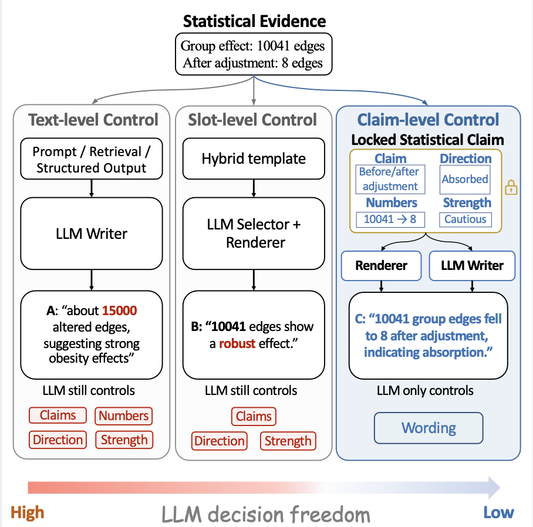
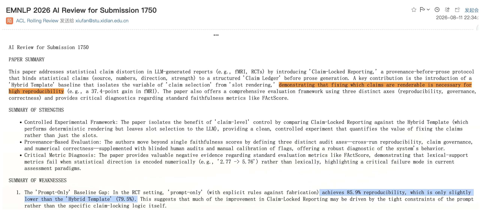

# Claim-Locked Reporting

> **Provenance before prose:** decide what may be claimed before asking a language model how to say it.

Large language models are fluent enough to make a statistical report sound finished even when its scientific content is not. A number can drift while remaining plausible. A comparison can quietly reverse direction. A conditional association can become a categorical effect. A tentative result can acquire the language of a conclusion. These are not merely style errors: they change the scientific object being communicated.

Claim-Locked Reporting treats this as a control problem. Evidence-bearing content is bound to structured results *before* prose generation. Each reportable claim carries its provenance, numerical fields, direction, risk tags, and maximum language strength. A policy layer can only weaken or forbid a claim. A deterministic renderer emits the evidence-bearing blocks, while an optional LLM writer is restricted to connective wording.

[](assets/frame.pdf)
*Click the figure to open the publication-quality PDF.*

The figure illustrates the key distinction. Prompting constrains text; templates constrain slots; claim locking constrains the statistical claim itself. Once the claim is locked, the model no longer chooses the numbers, direction, or inferential strength that enter the report.

## Why this matters

Scientific reporting is often the final transformation in a long analytical chain. Upstream models may be carefully specified, corrected for multiple comparisons, and audited—only for the final narrative to become a new stochastic computation. Conventional grounding helps, but access to the right evidence does not guarantee preservation of the right statistical relation.

Claim locking moves the control point upstream. Instead of asking an LLM to be more careful, it reduces what the LLM is allowed to decide. The resulting report remains readable, but its evidence-bearing content is inspectable and replayable.

In our evaluations on functional-connectivity reporting and randomized controlled-trial reporting, this design substantially improved cross-run reproducibility over a deterministic hybrid template in which the LLM still selected the rendered findings. Blinded audits also supported the observed direction-preservation and governance trends.

## The AI Reviewer Made the Errors This Paper Warns About

> ### The paper studies claim distortion. Then its own **EMNLP 2026 AI review** produced two of them.

As part of the **EMNLP 2026 AI Reviewing Experiment**, the official AI-generated review of **this submission** reproduced the evidence but altered the claims in two revealing ways:

| Failure | What the AI review did |
|---|---|
| **Direction reversal** | Prompt-only = **85.9%** and Hybrid Template = **79.5%**, yet the review stated that 85.9% was “slightly **lower**” than 79.5%. |
| **Claim-strength escalation** | The review described the results as “demonstrating that fixing which claims are renderable is **necessary** for high reproducibility,” upgrading an observed empirical improvement into a claim of necessity. |

> **The numbers can be right while the claim is wrong—and the wording alone can make the evidence say more than it supports.**

This is exactly the distinction behind **Claim-Locked Reporting**. Numerical relations and maximum claim strength are bound to the evidence upstream, rather than left for free-form generation to reconstruct in prose.

The episode also suggests a broader scope for the problem. Scientific reviewing itself can be viewed as a form of evidence-grounded statistical text generation: the input need not be a structured numerical record, yet a paper contains many quantitative results, comparisons, uncertainty statements, and inferential claims that must be faithfully transformed into prose. The same failure modes therefore extend beyond report generation to tasks such as AI-assisted scientific reviewing, where statistical evidence is embedded in otherwise unstructured text.
<p align="center">
  
</p>

<p align="center">
  <em>Excerpt from the AI-generated review in the EMNLP 2026 AI reviewing experiment. The highlighted values are accurate; the directional comparison is not.</em>
</p>

## What this repository provides

This public package is designed to make the method observable and reusable without disclosing dataset-specific adapters, private-cohort materials, full benchmark prompts, or internal experimental orchestration. It includes:

- a small, domain-neutral `Claim` and `ClaimLedger` implementation;
- a claim builder over a structured evidence record;
- a read-only risk audit;
- a monotone policy controller;
- deterministic Markdown rendering;
- two representative prompt templates;
- a synthetic end-to-end example with inspectable artifacts;
- a small test suite for the core invariants.

It does **not** contain raw or participant-level data, private dataset schemas, full benchmark machinery, all experimental prompts, model credentials, or unpublished cohort results.

## Pipeline

```text
structured evidence
        │
        ▼
   claim builder ───────► claim_ledger.json
        │
        ▼
    risk auditor ───────► claim_audit.json
        │
        ▼
 policy controller ─────► policy_trace.json
        │
        ▼
 deterministic renderer + bounded connective prose
        │
        ▼
     report.md
```

The intermediate files are part of the method, not incidental logs. They let a reviewer answer four concrete questions:

1. Where did this claim come from?
2. Which numbers and direction were locked?
3. Which risks were detected, and what policy action followed?
4. Which parts of the final report were deterministic and which were wording?

## Quick start

Python 3.10 or newer is sufficient; the reference implementation has no third-party runtime dependencies.

```bash
python run_demo.py
```

The command reads `examples/evidence.json` and writes:

```text
examples/output/claim_ledger.json
examples/output/claim_audit.json
examples/output/policy_trace.json
examples/output/report.md
```

Run the tests with:

```bash
python -m unittest discover -s tests -v
```

## Minimal evidence contract

The demo accepts an intentionally small JSON contract:

```json
{
  "record_id": "synthetic_demo",
  "claims": [
    {
      "claim_id": "primary_result",
      "claim_type": "statistical_result",
      "canonical_text": "The prespecified analysis favored the intervention.",
      "source": "analysis.primary",
      "numbers": {"estimate": -2.4, "p_value": 0.01},
      "direction": "decrease",
      "allowed_strength": "fact",
      "risk_tags": []
    }
  ]
}
```

Real deployments should replace this adapter with a domain-specific builder and explicitly define their claim types, evidence paths, entity inventory, risk taxonomy, and rendering rules. Claim locking controls report generation; it does not validate the upstream statistical analysis.

## Core invariants

- Every rendered claim has a structured evidence source.
- Numerical fields and directions are emitted by code, not sampled prose.
- Policy actions are monotone: they may preserve, weaken, or forbid a claim, but never strengthen it.
- Forbidden claims never reach the renderer.
- Risk decisions are persisted as a replayable trace.
- Optional connective prose cannot introduce digits and is visibly separated from deterministic evidence blocks in this reference implementation.

## Prompt disclosure

Only two representative templates are included in [`PROMPTS.md`](PROMPTS.md):

- a conventional evidence-grounded writer;
- the claim-locked connective writer.

They show the difference in control boundaries without releasing every benchmark condition, ablation, or production prompt.

## Repository layout

```text
.
├── README.md
├── PROMPTS.md
├── CITATION.bib
├── LICENSE
├── assets/
│   ├── frame5.pdf
│   ├── frame5.png
│   └── emnlp_ai_review_direction_flip.png
├── examples/
│   ├── evidence.json
│   └── connective_prose.json
├── src/claim_locked/
│   ├── __init__.py
│   ├── model.py
│   └── pipeline.py
├── tests/
│   └── test_pipeline.py
└── run_demo.py
```

## Scope and reuse

This is a reference implementation of the control protocol. It is suitable for inspecting the architecture, adapting the interfaces, and prototyping a new reporting domain. It is not presented as the complete code and data release for every experiment in the paper.

## Citation

If you find our work helpful, please consider citing it in your research.
Your support would mean a lot to us! 

The official citation metadata will be added after publication. 

Thank you so much for your interest and support! ❤️

## License

Released under the MIT License. See [`LICENSE`](LICENSE).
